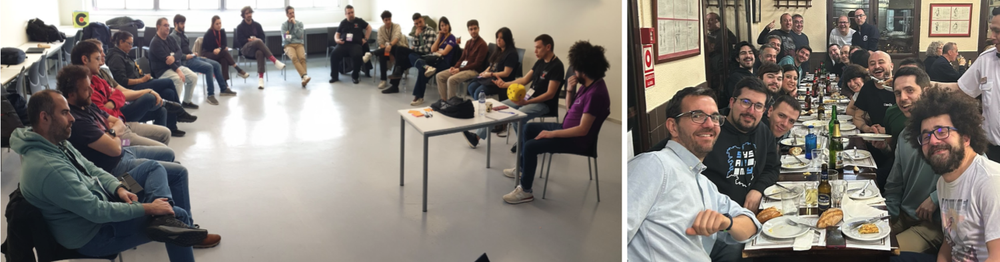

# Cómo contribuir

**¿Quién puede participar?**  
Esta iniciativa está dirigida principalmente a personas que dinamizan comunidades técnicas relacionadas con el día a día del desarrollo y la tecnología.

> **Aclaración**: Si aún no dinamizas una comunidad, pero estás pensando en hacerlo y buscas ayuda u orientación, también es para ti.

---

## ¿Sobre qué se puede hablar?

De lo que te interese o preocupe:

- Hacer preguntas, compartir ideas, pedir consejos o ayuda (1)(2), ...
- Compartir experiencias sobre los retos en tu comunidad
- Proponer encuentros (presenciales u online) sobre temas concretos
- Lanzar ideas de nuevas iniciativas que te gustaría poner en marcha
- Sugerir colaboraciones entre comunidades
- [Lo que se te ocurra]

> ℹ️ **Nota (1)**: No tengas reparo en pedir ayuda. Incluso si no has participado antes, **está bien hacerlo** 👍.  
> ⚠️ **Nota (2)**: Por sentido común, lo que no está bien es aparecer solo cuando se necesita algo 😉.

---

## Ok, quiero participar... ¿cómo lo hago?

Hay muchas formas de colaborar, tantas como tipos de personas. Puedes:

- [Participar en los foros de discusión](#foros-de-discusión)
- [Asistir a encuentros presenciales](#encuentros-presenciales)
- [Unirte a los encuentros online mensuales](#encuentros-online-mensuales)
- [Proponer nuevos encuentros online temáticos](#otros-encuentros-online)
- [Unirte al chat de Discord](#chat-de-discord)
- [Usar la lista de correo](#lista-de-correo)

---

## Foros de discusión

Visita: [GitHub Discussion](https://github.com/orgs/ComBuildersES/discussions) para participar en hilos existentes o crear uno nuevo.

Hemos creado [múltiples categorías](https://github.com/orgs/ComBuildersES/discussions/new/choose). Si crees que tu tema no encaja en ninguna, [avísanos aquí](https://github.com/orgs/ComBuildersES/discussions/categories/github-discussions).

> ⭐ **Recomendación**: para estar al tanto de todo, [activa las notificaciones por email](https://github.com/orgs/ComBuildersES/discussions/1)

---

## Encuentros presenciales

En una época donde pasamos tantas horas frente a pantallas, muchas personas valoramos encontrarnos cara a cara.

Aunque estamos bastante repartidos geográficamente, hay oportunidades para vernos. Te animamos a:

- Consultar las [quedadas presenciales propuestas](https://github.com/ComBuildersES/punto-de-encuentro/issues?q=sort%3Aupdated-desc%20is%3Aissue%20is%3Aopen%20label%3Aquedada-presencial) y avisar si vas a asistir.
- Proponer una nueva quedada usando [este issue template](https://github.com/ComBuildersES/punto-de-encuentro/issues/new?template=prop%C3%B3n-una-quedada.md)

También puedes crear un issue si:

- **Vas a desplazarte a otra ciudad** y quieres aprovechar para quedar con personas de la comunidad.
- Organizas una conferencia y quieres **proponer una actividad dirigida a *community builders*** (open space, sesión social, etc).

> **FYI**: Además, propusimos [organizar un gran encuentro presencial](https://github.com/orgs/ComBuildersES/discussions/19)... pero falta quien se anime a liderarlo (si te animas... ¡dilo! 😜).

---

## Encuentros online mensuales

Todos los meses organizamos dos encuentros online por Discord, abiertos a cualquier persona de la comunidad. El objetivo es mantener el contacto, dar la bienvenida a nuevas incorporaciones y comentar los temas del orden del día, que se publica previamente en [Encuentros](https://github.com/orgs/ComBuildersES/discussions?discussions_q=is%3Aopen+Encuentro+mensual+Community+Builders).

📅 Puedes consultar y sincronizar el calendario desde [aquí](https://calendar.google.com/calendar/u/0/embed?src=f2f7ea80a4574348bf203e13678878ddbf8e5677b8e04f05b28e870745aa8b12@group.calendar.google.com&ctz=Europe/Madrid)

> 📌 **Nota**: Si no quieres perderte nada, puedes [añadir este ICS a tu calendario](https://calendar.google.com/calendar/ical/f2f7ea80a4574348bf203e13678878ddbf8e5677b8e04f05b28e870745aa8b12%40group.calendar.google.com/public/basic.ics)

---

### Otros encuentros online

Los encuentros explicando en el apartado anterior no tienen un foco concreto en una temática, y se van decidiendo mes a mes. 

Por eso, si hay un tema concreto sobre el que te gustaría debatir con otras personas de la comunidad en un encuentro online, ya sea puntual o recurrente, te animamos a que lo propon, os animamos a que [abras un issue con tu propuesta](https://github.com/ComBuildersES/punto-de-encuentro/issues/new?template=proponer-un-encuentro-online.md), para que puedas coordinarte con otras personas interesadas en participar.

> ℹ️ **Aviso**: No es necesario tomar actas ni hacer algo formal. Está bien que estos encuentros sean relajados e informales.

---

## Chat de Discord

Si prefieres algo más inmediato que los foros, puedes usar el servidor de Discord al que se te dio acceso al entrar en la comunidad. Allí puedes hablar con otras personas en tiempo real.

> **Nota**: Si aún no tienes acceso escríbe a [los admins](https://github.com/ComBuildersES/.github/blob/main/FAQ.md#qui%C3%A9nes-administran-community-builders)

---

## Lista de correo

Aunque no todas las personas usan las notificacines de GitHub o asisten a los encuentros, sí están todas dadas de alta en la [lista de correo](https://groups.google.com/g/community-builders-es): `community-builders-es@googlegroups.com`.

Puedes escribir a la lista si:

- Hiciste una consulta en GitHub y no tuviste respuesta.
- Quieres compartir algo importante con toda la comunidad.

> ❓ ¿Tienes dudas sobre si procede enviar un correo a la lista? Pregúntanos [abriendo un issue aquí](https://github.com/ComBuildersES/gestion-interna/issues)
